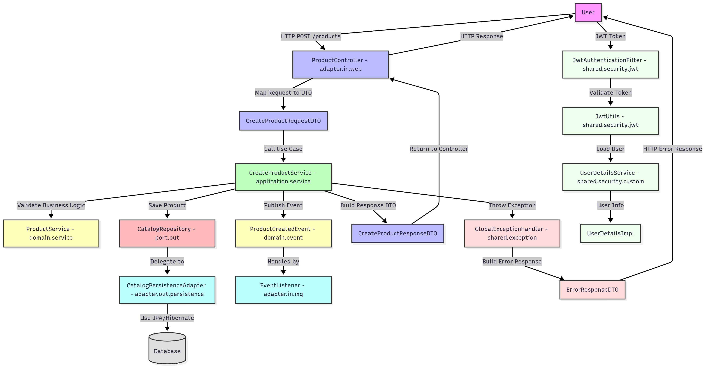

# 🛠️ Spring Boot - Hexagonal Architecture with DDD

## 🧩 Tổng quan

Dự án này áp dụng mô hình **Hexagonal Architecture (Ports and Adapters)** kết hợp với **Domain-Driven Design (DDD)** nhằm tách biệt rõ ràng giữa:

- Logic nghiệp vụ (domain logic)
- Hạ tầng (infrastructure)
- Cổng vào (REST, events)
- Cổng ra (database, hệ thống ngoài)

Mô hình này giúp code dễ kiểm thử, dễ bảo trì và dễ mở rộng.

--- 
## Hexagonal Architecture

```
                [ External World ]
┌────────────┬──────────────┬────────────┐
│ REST API   │ CLI, Events  │ UI         │   ← Input Adapters
└────────────┴──────────────┴────────────┘
         ↓         ↓            ↓
      [ INPUT PORT / USE CASES ]        ← Xử lý yêu cầu
         ↓
    [ DOMAIN (Entities, Logic) ]        ← Nơi nghiệp vụ "sống"
         ↓
   [ OUTPUT PORT / INTERFACE ]          ← Định nghĩa hành vi cần từ bên ngoài
         ↓
┌────────────┬──────────────┬────────────┐
│ Database   │ Kafka, Email │ External   │   ← Output Adapters
└────────────┴──────────────┴────────────┘

```

## Domain-Driven Design (DDD)
DDD là phương pháp thiết kế phần mềm tập trung vào nghiệp vụ thực tế thông qua mô hình "domain model".

DDD gồm 3 lớp chính:

- Domain Layer – nơi định nghĩa Entity, ValueObject, DomainService

- Application Layer – nơi xử lý Use Case (như CreateOrder, RegisterUser)

- Infrastructure Layer – nơi implement chi tiết kỹ thuật (DB, REST, Kafka...)

---

---

## 🧱 Kiến trúc tổng quát

```
           [ External World ]
┌─────────────────────────────────────────────┐
│           REST / External Adapter           │
│                                             │
│   ┌─────────────────────────────────────┐   │
│   │          Application Layer          │   │   ← Cổng vào (Input Port)
│   │  - Use cases                        │   │
│   │  - Điều phối nghiệp vụ              │   │
│   └─────────────────────────────────────┘   │
│   ┌─────────────────────────────────────┐   │
│   │            Domain Layer             │   │
│   │  - Domain model                     │   │
│   │  - Domain services                  │   │   ← Cốt lõi nghiệp vụ
│   └─────────────────────────────────────┘   │
│   ┌─────────────────────────────────────┐   │
│   │       Infrastructure Adapter        │   │   ← Cổng ra (Output Port)
│   │  - JPA, Kafka, etc.                 │   │
│   └─────────────────────────────────────┘   │
└─────────────────────────────────────────────┘
```

---

## 📁 Cấu trúc thư mục

```
src.main.java.com.project
├── config                                          # Common configuration packages (Spring, JPA, etc.)
|   ├── SecurityConfig.java                         # Security Configuration (Spring Security, JWT, etc.)
│   ├── MapperConfig.java                           # Mapper configuration (MapStruct, ModelMapper, etc.)
|   └── ApplicationConfig.java                      # Application configuration (properties, DI wiring, etc.)
├── infrastructure                                  # Infrastructure package (configuration, adapter)
│   ├── core                                        # Cross-cutting infrastructure components
│   │    ├── observability                          # Configure logging, tracing (OpenTelemetry, etc.)
|   │    ├── metrics                                # Prometheus, Micrometer Configuration
|   │    ├── logging                                # Configure logging (Logback, etc.)
│   │    ├── scheduler                              # Scheduler configuration (Spring Scheduler, Batch, etc.)
│   │    └── migration                              # Migration configuration (Flyway, Liquibase)
│   ├── kafka                                       # Kafka producer/consumer configuration
│   │    ├── config                                 # Kafka Configuration (Producer, Consumer)
│   │    ├── adapter                                # Serializer, listeners/producers
│   ├── redis                                       # Redis configuration (cache, session)
│   │    ├── config                                 # Redis Configuration (RedisTemplate, Lettuce, etc.)
│   │    ├── cache                                  # Cache manager, cacheable methods, decorator
├── catalog                                         # Business module example
│   ├── application
│   │   ├── port
│   │   │   ├── in                                  # Input Port (Use‑case API) => One api / one Use-case
│   │   │   │   ├── CreateProductUseCase.java       # Use-case interface
│   │   │   └── out                                 # Output Port (Driven API)
│   │   │       ├── CatalogRepository.java          # Repository interface
│   │   ├── service                                 # Use‑case implementation 
│   │   │   ├── CreateProductService.java           # Implements CreateProductUseCase
│   │   └── validation                              # Semantic validators
│   │       ├── ProductValidator.java               # Validate product data
│   ├── domain
│   │   ├── model                                   # Entity, VO, Aggregate
│   │   │   ├── Product.java                        # Product entity
│   │   └── event                                   # Domain events
│   │       ├── ProductCreatedEvent.java            # Event when product is created
│   ├── adapter
│   │   ├── in                                      # Inbound Adapters
│   │   │   ├── web                                 # REST controllers & payload
│   │   │	│    ├── mapper             
│   │   │	│    │   └── ProductMapper.java     # Mapper Dto -> to Domain
│   │   │	│    └── controller
│   │   │	│        └── ProductController.java # REST controller for product
│   │   │   ├── websocket                           # WS handlers/payload
│   │   │	│    ├── mapper
│   │   │   └── mq                                  # MQ listeners/payload
│   │   │	│    ├── mapper
│   │   └── out                                     # Outbound Adapters (persistence, api)
│   │       ├── persistence                         # Persistence
│   │       │   ├── entity                          # JPA/Hibernate entities
│   │       │   │   └── CatalogJpaEntity.java
│   │       │   ├── mapper                          # MapStruct: Domain ↔ JPA Entity
│   │       │   │   └── CatalogEntityMapper.java
│   │       │   ├── repository                      # Spring-Data interface | Repo | Customize | Somethings
│   │       │   │   └── CatalogJpaRepository.java
│   │       │   └── CatalogPersistenceAdapter.java  # implements catalog.application.port.out.*
│   │       │
│   │       └── api     
│   │           ├── externalApiClient.java          # Client to external API
│   │           └── externalApiMapper.java          # Mapper for external API
│   └── package-info.java                           # Package information for catalog module
├── shared
│   ├── aop                                         # Aspect Oriented Programming (logging, security, v.v.)
|   |   └── ObservabilityAspect.java                # Aspect for observability (logging, tracing)
│   ├── exception                                   # Custom exceptions
|   |   └── GlobalExceptionHandler.java             # Global exception handler
│   ├── util                                        # Utilities (date, string, v.v.)
|   |   └── DateUtils.java                          # Utility class for date operations
│   ├── security                                    # Security utilities (JWT, v.v.)
│   │   ├── custom                                  # Custom security components
│   │   │   ├── UserDetailsService.java             # Custom user details service
│   │   │   └── UserDetailsImpl.java                # Implementation of UserDetails
│   │   ├── jwt                                     # JWT utilities
│   │   │   ├── JwtUtils.java                       # JWT utility class
│   │   │   └── JwtAuthenticationFilter.java        # Filter for JWT authentication
│   ├── validation                                  # Custom validators
│   │   │   ValidPassword.java                      # Custom password validation annotation
|   |   └── PasswordValidator.java                  # Custom password validation logic (Implement ConstraintValidator)
|   ├── base                                        # Base classes for common functionality
│   │   ├── BaseEntity.java                         # Base entity class with common fields
│   │   ├── BaseRepository.java                     # Base repository interface for common methods
│   │   ├── BaseService.java                        # Base service class for common logic
│   │   ├── BaseController.java                     # Base controller class for common endpoints
│   │   ├── BaseRequest.java                        # Base request class for common fields
│   │   └── BaseResponse.java                       # Base response class for common fields
│   └── constants                                   # Constants used across the application
│       ├── ErrorCodes.java                         # Error codes for exceptions
│       ├── Messages.java                           # Common messages used in the application
│       └── Roles.java                              # User roles and permissions
└── Application.java                                # Entry point of the Spring Boot application

```

---

## Web REST data-flow walkthrough
- Người dùng gửi yêu cầu HTTP đến Controller tại `catalog.adapter.in.web.controller.ProductController`
- Controller chuyển đổi request thành DTO và gọi Use Case tại `catalog.application.service.CreateProductService`
- Use Case thực thi nghiệp vụ chính, có thể gọi:
  - Domain Service tại `catalog.domain.service.ProductService` để xử lý logic nghiệp vụ
  - Repository tại `catalog.application.port.out.CatalogRepository` để truy xuất dữ liệu
- Repository sử dụng Persistence Adapter tại `catalog.adapter.out.persistence.CatalogPersistenceAdapter` để tương tác với cơ sở dữ liệu
- Persistence Adapter sử dụng JPA/Hibernate để thực hiện các thao tác CRUD trên cơ sở dữ liệu
- Nếu có sự kiện xảy ra (ví dụ: sản phẩm được tạo), Use Case sẽ phát hành Domain Event tại `catalog.domain.event.ProductCreatedEvent`
- Các Event Listener tại `catalog.adapter.in.mq` sẽ lắng nghe sự kiện này và thực hiện các hành động cần thiết (ví dụ: gửi thông báo, cập nhật hệ thống khác)
- Use Case trả về Response DTO cho Controller
- Controller chuyển đổi Response DTO thành HTTP Response và trả về cho người dùng
- Nếu có lỗi xảy ra, Global Exception Handler tại `shared.exception.GlobalExceptionHandler` sẽ xử lý và trả về mã lỗi phù hợp
- Người dùng có thể xác thực thông qua JWT, được xử lý bởi `shared.security.jwt.JwtAuthenticationFilter` và `shared.security.jwt.JwtUtils`
- JWT được tạo và xác thực thông qua `shared.security.jwt.JwtUtils` và `shared.security.custom.UserDetailsService`
- Người dùng có thể đăng nhập để nhận JWT, sau đó sử dụng JWT này trong các yêu cầu tiếp theo để xác thực
### Data-flow Diagram


---
